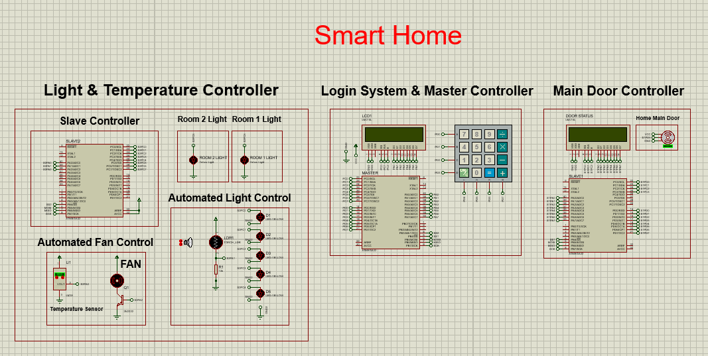
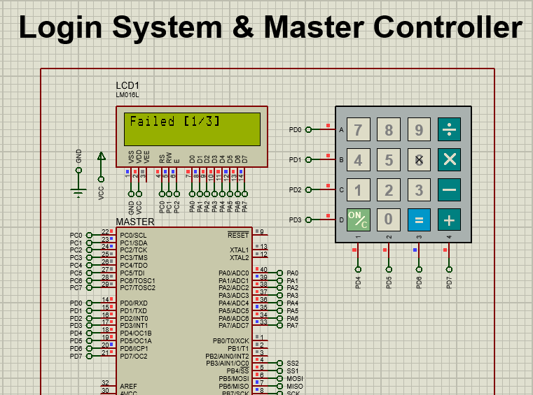
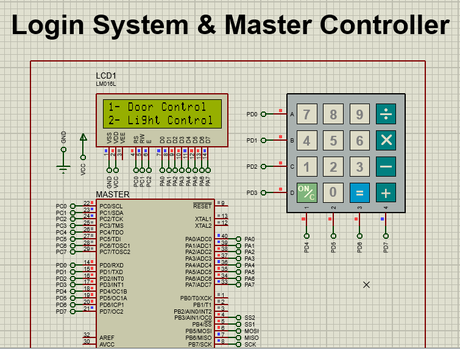
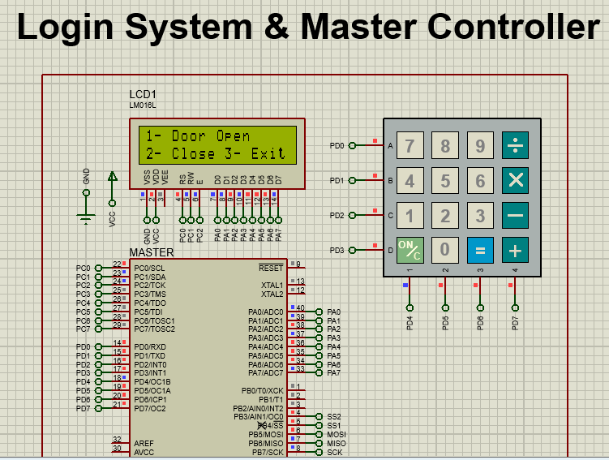
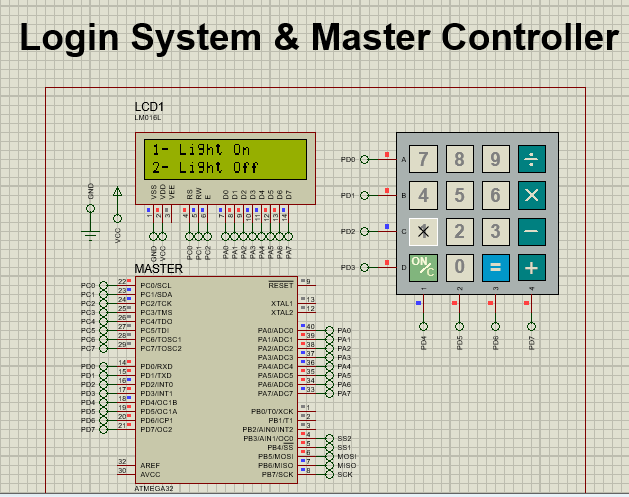
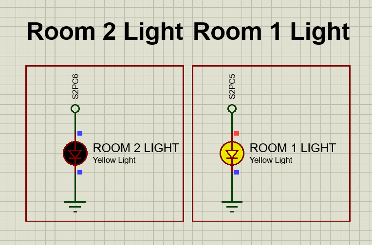
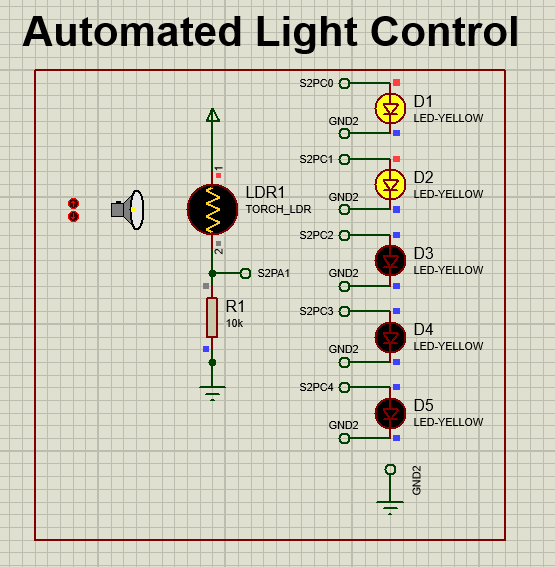

# Smart Home Control System



This project is my graduation project of the Information Technology Institute's Summer Training Program 7/9/2023

---

## Table of Contents

- [Project Overview](#project-overview)
- [Hardware Components](#hardware-components)
- [Features](#features)
- [Installation](#installation)
- [Usage](#usage)
  - [Prerequisites](#prerequisites)
  - [Compiling the Scripts](#compiling-the-scripts)
  - [Importing Hex files into proteus](#importing-hex-files-into-proteus)
- [Software Code Usage](#software-code-usage)
  - [Master Script APP.h](#master-script-(app.h))
  - [Slave 1 Script APP.h](#slave-1-script-(app.h))
  - [Slave 2 Script APP.h](#slave-2-script-(app.h))
- [How does the algorithm work?](#algorithm)
- [ScreenShots](#screenshots)

---

## Project Overview

The Smart Home Control System is an embedded systems project that allows users to control various home automation functions using a keypad and an LCD screen. This project serves as a secure and convenient way to manage doors and lights in different rooms within a smart home environment.

The system employs AVR microcontrollers, SPI communication, and a custom keypad interface to provide users with functionalities such as door control and room light management. Users must log in with a password to access the system's features, and multiple fail login attempts can lead to account locking.

It consists of three main components:
- **Master Microcontroller**: Controls the user interface and communicates with the slave microcontrollers.
- **Slave 1 Microcontroller**: Manages door control using a servo motor.
- **Slave 2 Microcontroller**: Monitors and controls room temperature, lighting, and a fan.

---

## Hardware Components

- AVR ATmega32 Microcontroller (Master)
- AVR ATmega32 Microcontroller (Slave 1)
- AVR ATmega32 Microcontroller (Slave 2)
- Servo Motor
- Temperature Sensor (LM35)
- Light-Dependent Resistor (LDR)
- LEDs (7)
- LCD Display (2 LCD 16*2)
- Keypad
- DC motor

## Features

- Secure user login with password protection
- Door control options (open and close)
- Room light control (on and off)
- Account lockout for security purposes
- Temperature monitoring and fan control
- Light-dependent resistor (LDR) based LED control
- SPI communication between master and slave devices
- User-friendly LCD interface
- Modular and well-documented code

---

## Installation

1. Clone the repository to your local machine:

   ```bash
   git clone https://github.com/AhmedMohamed264/Smart_Home_Atmega32_SPI.git

---

## Usage

Follow these steps to compile the master, slave1, and slave2 scripts using an IDE such as Eclipse (preferred) or Atmel Studio and then import the three hex files to the Proteus project.

### Prerequisites

1. **AVR Development Environment:** Ensure you have the necessary AVR development environment set up, including avr-gcc and avr-libc.

2. **IDE (Eclipse or Atmel Studio):** Use an Integrated Development Environment (IDE) for AVR programming, such as Eclipse or Atmel Studio.

### Compiling the Scripts

1. **Open the IDE:** Launch your preferred IDE (Eclipse or Atmel Studio).

2. **Create Projects:** Create separate projects for the master, slave1, and slave2 scripts.

3. **Import Code:** Import the corresponding script code into their respective projects.

4. **Configure Project Settings:** Configure the project settings to match your AVR microcontroller specifications, including clock frequency and microcontroller type.

5. **Compile Code:** Build each project to compile the code. This step generates the hex files for each script.

### Importing Hex files into proteus

1. Open Proteus: Launch Proteus, the simulation and design software.
2. Open the Project: Open the Proteus project file located in the "Proteus" folder of the cloned repository.
3. Add Microcontrollers: In the Proteus project, add the AVR microcontrollers that correspond to your master and slave devices. Make sure to configure them with the same specifications as used in the IDE projects.
4. Upload Hex Files: For each microcontroller (master and two slaves), right-click on the microcontroller, and choose "Edit Properties." In the properties window, under the "Program File" section, select the corresponding hex file that you compiled earlier for each microcontroller.
5. Connect Components: Connect the components and wires in Proteus as required by your project design.
6. Simulate: Start the simulation to see your smart home control system in action.

Enjoy Your Smart Home Control System!
Now you can enjoy the convenience and security of your smart home control system simulation in Proteus.

---

## Software Code Usage

Explaining the header files of the prjoect

## Master Script (app.h)

### `void APP_voidWelcome(void)`

Displays a welcome message on the LCD.

### `u8 APP_u8GetKey(void)`

Polls and returns the key pressed by the user on the keypad.

### `void APP_voidGetPassword(u8 *A_u8Password)`

Asks the user to enter a password and stores it in the provided pointer.

### `u8 APP_u8CheckPassword(u8 *string1, u8 *string2)`

Compares two strings and returns `CORRECT_PASSWORD` if they match, otherwise `WRONG_PASSWORD`.

### `u8 APP_u8LoginToSystem(void)`

Prompts the user to log in and checks for account lockout. Returns `ACCESS_GRANTED` if login is successful, otherwise `ACCOUNT_LOCKED`.

### `void APP_voidShowOptions(APP_Options optionToShow)`

Displays available options on the LCD based on the provided `optionToShow`.

### `u8 APP_u8HandleOptions(APP_Options optionToShow)`

Handles user option input based on the provided `optionToShow`.

### `void APP_voidSendLightStatus(u8 A_u8Room, u8 A_u8LightOption)`

Sends light control commands to slave devices based on the selected room and light option.

## Slave 1 Script (app.h)

### `void APP_voidDoorOpen(void)`

Opens the door (sets servo motor angle to +90).

### `void APP_voidDoorClose(void)`

Closes the door (sets servo motor angle to -90).

## Slave 2 Script (app.h)

### `void APP_voidReadTemperature(void)`

Reads the current temperature value in Celsius using the LM35 sensor.

### `void APP_voidUpdateFanStatus(void)`

Updates the fan status (on/off) based on the temperature read from the LM35 sensor.

### `void APP_voidReadLDR(void)`

Reads the current Light-dependent Resistor (LDR) value.

### `void APP_voidAdjustLEDSOn(void)`

Adjusts the number of LEDs turned on based on the LDR value.

### `void APP_voidCheckMasterCode(u8 A_u8Code)`

Checks the option code received from the master via SPI and updates room light status accordingly.

### `void APP_voidUpdateRoomsLight(void)`

Updates room lighting based on commands received from the master.

feel free to add your own APIs and develop the project

---

## Algorithm

### Master Script (main.c):

1. Initialize the necessary pins for SPI communication, LCD, keypad, and LEDs.
2. Display a welcome message on the LCD.
3. Ask the user to log in to the system and check for account lockout.
4. If the account is locked, the program stops; otherwise, it proceeds.
5. Continuously loop:
   - Display available options (main menu) on the LCD.
   - Wait for the user to input an option.
   - Handle the user's choice:
     - If the user selects door control:
       - Display door control options (open/close) on the LCD.
       - Wait for the user to input an option.
       - Send the selected option (open or close) to Slave 1.

     - If the user selects light control:
       - Display light control options (room 1/2 and on/off) on the LCD.
       - Wait for the user to input an option.
       - Send the selected room and light control option to Slave 2.

### Slave 1 Script (main.c):

1. Initialize the necessary pins for SPI communication, servo motor, and LCD.
2. Continuously loop:
   - Receive the option code (open/close) from the master via SPI.
   - If the received code is '1', open the door (set servo motor angle to +90) and display "Door Opened!" on the LCD.
   - If the received code is '2', close the door (set servo motor angle to -90) and display "Door Closed!" on the LCD.

### Slave 2 Script (main.c):

1. Initialize the necessary pins for SPI communication, ADC (for temperature and LDR), fan control, and LEDs.
2. Continuously loop:
   - Receive the option code (room/light control) from the master via SPI.
   - Check the received code to determine the action:
     - If the code corresponds to room 1 light control (on/off), update the status of room 1's LED.
     - If the code corresponds to room 2 light control (on/off), update the status of room 2's LED.
     - Read the current temperature using the ADC.
     - Adjust the fan status based on the temperature threshold.
     - Read the Light-Dependent Resistor (LDR) value.
     - Adjust the number of LEDs turned on based on the LDR reading.

---

## Screenshots

Here are some screenshots of the Smart Home Automation System in action:


   *Login system is displayed on LCD screen to ask the user to prompt the password.*



   *Incorrect password. Access denied.*



   *Main menu with available options.*



   *Door control menu.*


   
   *The door has been opened (servo motor rotated to +90 angle), and the LCD displays the message "Door Opened!" for confirmation.*



   *Light control menu.*



   *Room 1 light control.*



   *Automated light control based on ambient light.*
